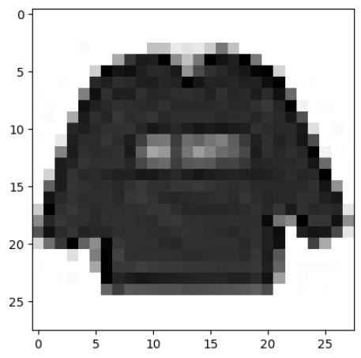
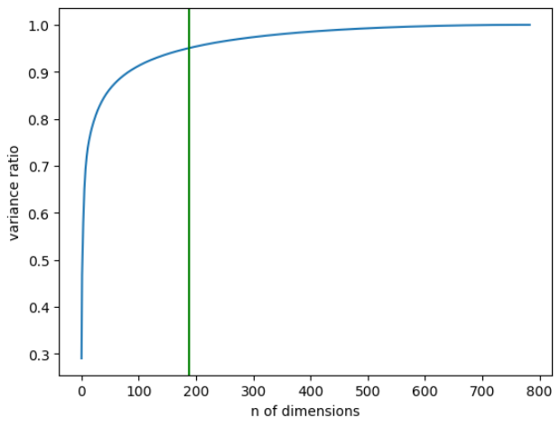
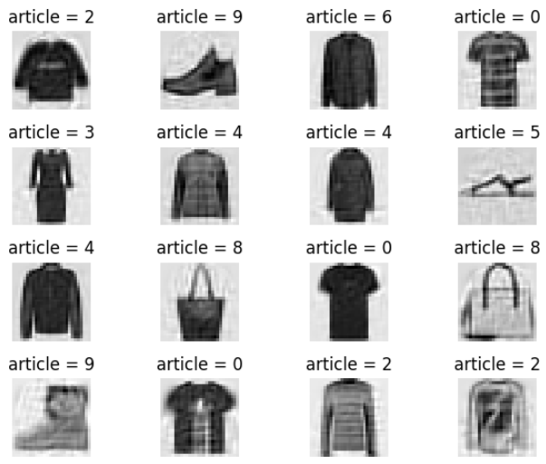

# Fundamentals of Data Science Winter Project                                19.01.2023     

## Sources:  

Hands-On Machine Learning with Scikit-Learn and TensorFlow by Geron Aurelien 

https://corochann.com/mnist-dataset-introduction-532/ 

https://www.kaggle.com/datasets/zalando-research/fashionmnist?resource=download 

https://github.com/sharmaroshan/MNIST-Using-K-means/blob/master/KMeans%20Clustering%20for%20Imagery%20Analysis%20(Jupyter%20Notebook).ipynb 

https://medium.com/@joel_34096/k-means-clustering-for-image-classification-a648f28bdc47 

 

This project’s task was to explore different data science techniques, by performing Dimensionality Reduction, Classification and Clustering on a given data set. Throughout this project I have used algorithms such as: PCA, KMeans, KNN and more. The dataset that we will be working on is called Fashion Mnist Dataset. We will be teaching the algorithm how to recognize what clothing article is present on the Image.  In this project, aside from trying to get the best accuracy possible, it is important to recognize the differences between various image recognition methods, how some algorithms perform far better than others. This project was meant to be done without Deep Learning, therefore algorithms like CNN were not considered. 

## Data set summary

Firstly, we have to summarize the dataset. Fashion Mnist dataset consists of 70,000 labeled images of different clothing articles, each image is 28x28 pixels. The labels come in 10 classes as follows: 

| Label | Description |
| --- | --- |
| 0 | T-shirt/top |
| 1 | Trouser |
| 2 | Pullover |
| 3 | Dress |
| 4 | Coat |
| 5 | Sandal |
| 6 | Shirt |
| 7 | Sneaker |
| 8 | Bag |
| 9 | Ankle boot |
 

 

Each pixel has a single value associated with it (1-255), indicating the lightness and darkness of that pixel, with higher numbers meaning darker. 

 

When working with labeled data, often supervised algorithms are what comes to mind first, but about that later. Between every classification task it is important to divide the data set into a train set and test set, to properly evaluate the algorithms performance in the end. Luckily, Fashion Mnist is already divided, first 60,000 records are for the train set, and the last 10,000 records are for test set.  

Now that we know how our data set looks like, let’s get to plotting some images. 

 

 

This is the first image in the data set, it’s labeled with 2, which is a Pullover, the x and y axis contain pixels from the 28x28 format, this set has a shape of 60,000 x 784, because of that we have to reshape this row into 28x28 format. Now let’s plot some more images to get a better feel at what we are working with.  

 

 

 

 

 

 

Looking at this plot, we can already see which classes our algorithm might struggle with, for example articles 4 and 6 can be hard to distinguish even by human eye. 

## Dimensionality Reduction

After understanding the data set, we can proceed to Dimensionality Reduction. It is an important step, because of the Fashion Mnist data set size. With 70,000 records, some algorithms will take a very long time to run. We will be using PCA Principal Component Analysis. To use it on our data set, we have to find the correct number of dimensions, we will be trying to use as little dimensions we can, while maintaining a strong variance ratio. I have decided to keep 95% of the original data.  

 

This plot shows the variance ratio to the number of dimensions, as we can see with about 187 dimensions, we maintain 95% of variance. We can also notice the plot’s “elbow”, it is a curve on a plot that often shows us the most cost-effective values. To make sure that we are not losing much information we can plot our train set after performing Principal Component Analysis. 

As we can see, almost no information was lost, this looks good.  

## Clustering

Next step is to perform clustering on our data set, this is an unsupervised learning algorithm, so we will not be using our labels (y_train). I have decided to use Mini Batch version of KMeans, because of the size we are working with. Naturally, we will be setting the number of clusters to 10, we want every cluster to be equal to one of our original classes. Aside from size reduction, PCA also removed some of the noise from our images, which makes the clustering perform better.  

Unfortunately, KMeans performed very poorly, it only got about 55% accuracy score.  

## Classification

To properly choose the best classification for this algorithm, we will be using and comparing results of 3 different algorithms. To get a better feel of model’s performance we will also be using cross_val_score, to divide our training set into folds, and perform the algorithm separately on each fold. The first one we are going to check is K Nearest Neighbors. To properly use KNN, we need to establish its hyperparameters, to do that we will use GridSearchCV. This method creates a grid for all hyperparameters under consideration and shows the best possible combination. After running this method a couple of times, the best number of neighbors seems to be 4, 6 or 8, all with similar accuracy at around 86%.  

The second classification algorithm that we are going to use is called SGDClassifier, this is a linear algorithm, that relies on randomness during performing choices. Without any optimization the performance was at about 80%, which is still considerably high. This time, to optimize this algorithm we will be using the Standard Scaler method. After applying scaler on our train set, the accuracy improved to about 83%, which is a good improvement, but still worse than KNN. On the other hand, using Standard Scaler with KNN decreased the model’s performance.  

Lastly, we will be using Random Forest Classifier. This algorithm performed competitively well to KNN, it also got about 86% accuracy on test folds. In the end we will choose K Nearest Neighbor as our final classifier.  

Finally, the accuracy score that we got on our test set is around 87%, I consider this accuracy to be really good, especially when done without any Deep Learning methods.  

 
